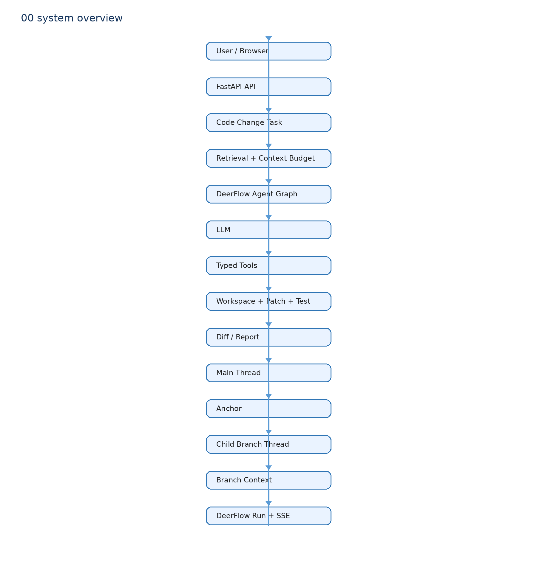

# 00 项目总览：先分清两条真实链路

本项目是 CodeOps Agent，基于 DeerFlow 2.0 二次开发。它不是重写 DeerFlow，也不是一个只有聊天功能的项目。

先记住两条不能混淆的链：

1. Coding Agent 代码修改链：前端创建 `Task`，Worker 准备 Workspace，受限 Agent 提出 Patch，普通 Python 代码应用 Patch、运行测试、生成报告。
2. 主聊天和 Anchored Branch 对话链：DeerFlow 的 Gateway Thread / Run / Checkpoint / SSE 真正参与其中。Branch 是独立 Child Thread。

## 关键事实

`code_change.Task.agent_thread_id` 和 `agent_run_id` 是 Task 的关联字段，帮助日志关联；Patch Agent 的 `create_deerflow_agent(...).invoke()` 没有创建 Gateway 持久化 Thread / Run，也没有配置 Checkpointer。因此不能说“一次 Code Change Task 会创建 DeerFlow Thread 和 Run”。

真正的 Thread / Run 在 Branch 里：`app/gateway/routers/anchored_branch.py::create_branch()` 建立 Child Thread，`stream_branch_run()` 调用 Gateway 的 `start_run()`。

## 代码地图

| 目的 | 真实入口 | 主要责任 |
| --- | --- | --- |
| 创建代码任务 | `frontend/src/app/workspace/code-change/code-change-console.tsx::handleCreateTask` | 收集 requirement、patch mode、模型名 |
| HTTP 控制面 | `backend/app/gateway/routers/code_change.py::run_project_task` | 创建并入队 Task |
| 执行任务 | `deerflow/code_change/worker.py::execute_task` | Workspace、检索、Agent、Patch、测试、报告 |
| Patch Agent | `deerflow/code_change/agent_patch.py::generate_patch_with_agent` | 组装初始 Prompt，驱动 DeerFlow Agent graph |
| Branch | `app/gateway/routers/anchored_branch.py` | Anchor、Child Thread、Branch Context、SSE |

## 项目边界

DeerFlow 上游：Agent Factory、LangGraph Tool Loop、Thread、Run、Checkpoint、SSE、SandboxProvider 抽象、Middleware 框架。

项目组合：限制 Agent Tool 集合，调用 DeerFlow Agent Factory，把模型输出接回 Worker 的 Patch/Test 链。

项目新增：Code Change Task/Worker/Workspace 流程、Hybrid Code Retrieval、Anchored Branch 的 Anchor、BranchRecord、BranchContextBuilder、Branch Panel。

当前没有 Decision Capsule、分支自动总结回 Main、Apply-to-Main 或自动 GitHub PR。这是范围约束，不是遗漏。

## 面试一句话

我复用 DeerFlow 的 Agent Runtime 和对话运行时；代码修改侧由我把检索、受限 Tool、确定性 Workspace/Test 串成工作流，分支侧由我在 DeerFlow Child Thread 上增加 Anchor 和独立上下文语义。
