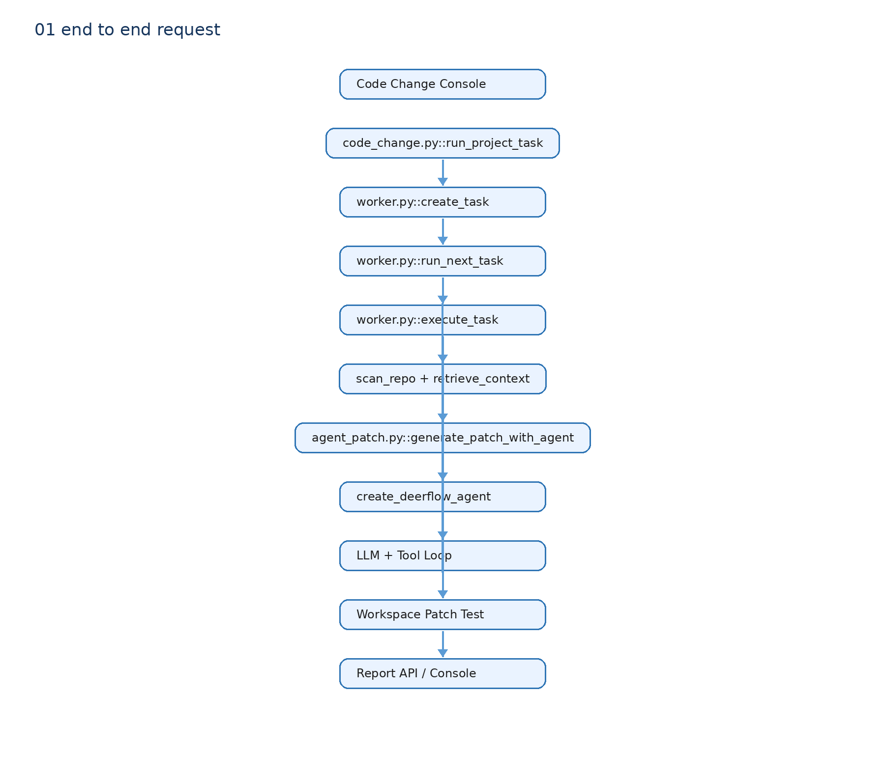
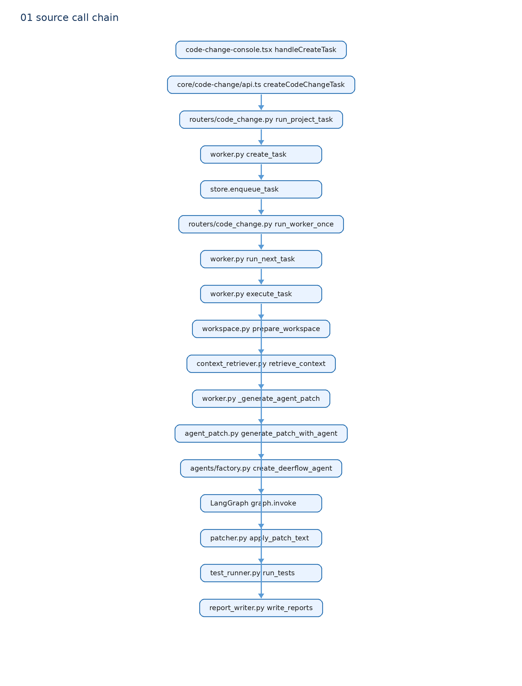

# 01 一次真实 Coding Agent 请求





本章选择 `patch_mode=agent` 的代码修改任务，而不是普通聊天。它最能说明项目的 Coding Agent 主体能力。

## 从按钮到 Task

`code-change-console.tsx::handleCreateTask()` 调用 `core/code-change/api.ts::createCodeChangeTask()`，向 `POST /api/code-change/projects/{project_id}/tasks` 发送 requirement、`patch_mode=agent` 和可选模型名。

`routers/code_change.py::run_project_task()` 调用 `worker.py::create_task()`。它读取 Project，验证 agent 模式不能同时携带外部 Patch，固定当前 Git HEAD，创建 `Task` 和 artifact 目录，写入 `QUEUED` 队列。HTTP 响应返回 Task JSON，不会同步等待模型完成。

内部 Worker 请求 `POST /worker/run-once` 后，`run_worker_once()` 调用 `run_next_task()`：它领取 Task、获得 claim/lease，再进入 `execute_task()`。普通用户不能调用这个端点，需要专用 Worker Token。

## execute_task 的真实顺序

```text
execute_task
→ prepare_workspace(project.repo_path, source_commit)
→ scan_repo(workspace)
→ retrieve_context(workspace, requirement)
→ _generate_agent_patch(task, workspace)
→ generate_patch_with_agent(...)
→ apply_patch_text(workspace, diff)
→ run_tests(workspace, approved command)
→ write_reports(task)
```

输入是 Task、Project 和固定 commit。输出是更新后的 Task：成功停在 `HANDOFF_READY`，失败停在 `FAILED` 并保留错误、日志和 artifact。

## LLM 真正收到什么

`worker.py::_generate_agent_patch()` 用 `deerflow.models.create_chat_model()` 创建配置中的聊天模型，然后调用 `agent_patch.py::generate_patch_with_agent()`。

该函数把 Worker 已召回的 `task.contexts` 交给 `build_retrieval_context()`，形成有 Token Budget 的 `context_bundle.prompt`。`base_prompt` 的内容是 requirement、受限代码上下文和“必要时使用 search/read，最后提交 unified diff”。随后调用 `graph.invoke({"messages": [HumanMessage(...)]})`。

这就是“Worker 检索结果进入 Agent 初始 Prompt”的源码证据。它不是把完整仓库复制给模型。

## 这条链没有什么

没有 Gateway 持久化 Thread、Run、SSE Token 流，也没有 Agent 直接写真实源仓。Patch Agent 只产生候选 diff；后半段副作用由 Worker 控制。

## 读到这里应能回答

用户提交任务后，前端先创建队列 Task；Worker 固定源码 commit 并复制 Workspace，先检索再把有预算的上下文放入 Agent Prompt。Agent 只提交 diff，Worker 负责应用、测试和报告。
