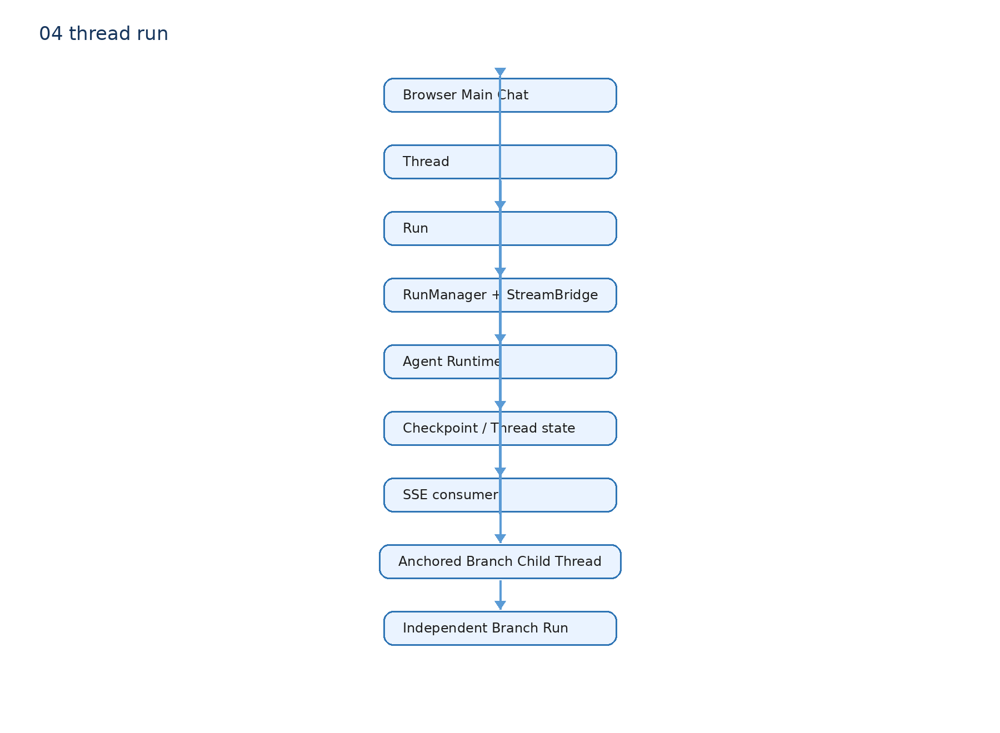
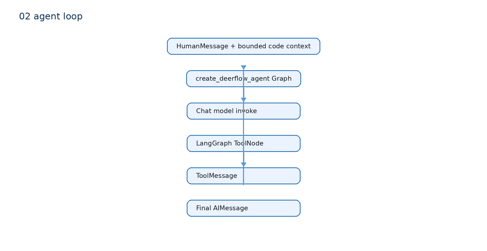

# 03 Agent、Thread、Run：哪些地方真的用了

## 先用普通语言理解

Thread 是一段可继续的对话身份，像“这个会话的文件夹”。Run 是在某个 Thread 上的一次执行，像“这一次点击发送后的处理记录”。同一个 Thread 可以有很多 Run。

## 真实 Branch 调用链

`anchored-branch-panel.tsx::handleCreate()` 发起 Branch 创建。`routers/anchored_branch.py::create_branch()` 验证主消息与选区，`_create_child_thread()` 建立 DeerFlow Child Thread，再保存项目自己的 `BranchRecord`。

用户在右栏发送追问时，`stream_branch_run()`：读取 Child Thread Checkpoint 的 history，构造 BranchContext，随后调用 `app/gateway/services.py::start_run()`，参数是 `child_thread_id`。RunManager 和 StreamBridge 接管真实 Agent 执行和 SSE 事件。

## Patch Agent 为什么不同

`agent_patch.py::generate_patch_with_agent()` 也传了 `configurable.thread_id`，但这个值只是 LangGraph invocation config。没有调用 Gateway `start_run()`，没有保存 Gateway Run，也没有配置 Checkpointer。它的 Task ID、agent_thread_id、agent_run_id 只能用于 Task 追踪。

## 什么时候需要学 Checkpoint

P0：知道 Branch 历史从 Child Thread 的 Checkpoint 读取，Main 和 Child 相互隔离。

P1：理解 Checkpoint 的具体序列化、数据库实现和恢复细节。

不要说“Patch Agent 的候选 diff 会写进 DeerFlow Thread history”，当前代码没有这样做。
