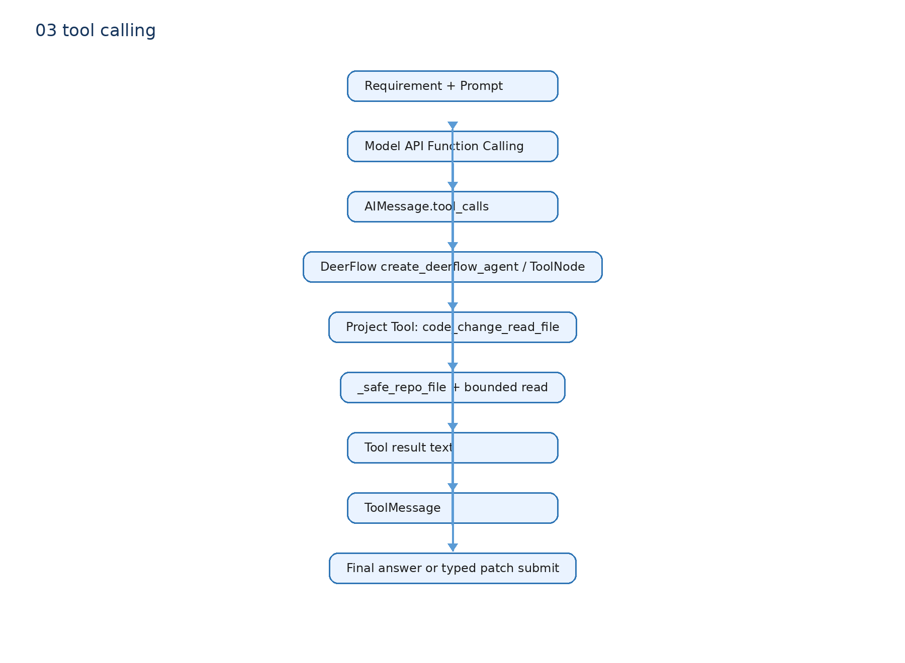

# 04 Tool Calling：模型如何读文件

## 为什么需要 Tool

模型参数里没有你的仓库文件。Tool 是模型 Function Calling 和真实 Python 函数之间的桥：模型提出“读哪个文件”，程序验证参数后执行，再把结果作为 ToolMessage 返回给模型。

## 真实代码

`agent_patch.py::build_code_change_tools()` 用 LangChain `@tool` 创建：

- `code_change_search(query)`：调用 `retrieve_context()` 返回候选代码块。
- `code_change_read_file(path, start_line, end_line)`：先经 `_safe_repo_file()` 防路径逃逸，只读索引内文件且限制行数和字符数。
- `code_change_submit_patch(patch_text, rationale)`：校验大小、路径和 `.git`，再执行 `git apply --check`；通过后才写入 `PatchCapture`。

`create_code_change_agent()` 把这三个 Tool 交给上游 `deerflow.agents.factory::create_deerflow_agent()`。模型返回 `AIMessage.tool_calls` 时，LangGraph 的 ToolNode 依据 schema 调用 Python 函数，把字符串结果封装为 ToolMessage，再回到模型节点。模型无 tool_call 时，graph 结束。

## 异常

非法读路径会抛错；非法 diff 的 `ToolException` 会终止当前图调用。`generate_patch_with_agent()` 只创建一次新图，并把真实 `git apply --check` 错误反馈给模型；第二次仍失败则 Task 失败，绝不无限循环。

## 三层不要混

模型 API：产生结构化 `tool_call`。

DeerFlow/LangGraph Runtime：解析、路由到 Tool、写 ToolMessage、决定回模型还是结束。

项目代码：定义具体 search/read/submit Tool 以及权限边界。

## 面试一句话

我没有手写 Tool Calling Runtime；我复用 DeerFlow 的 Agent/Tool 图执行，自己定义代码检索、受限读取和 typed Patch 提交 Tool，并在 Tool 层验证副作用。
