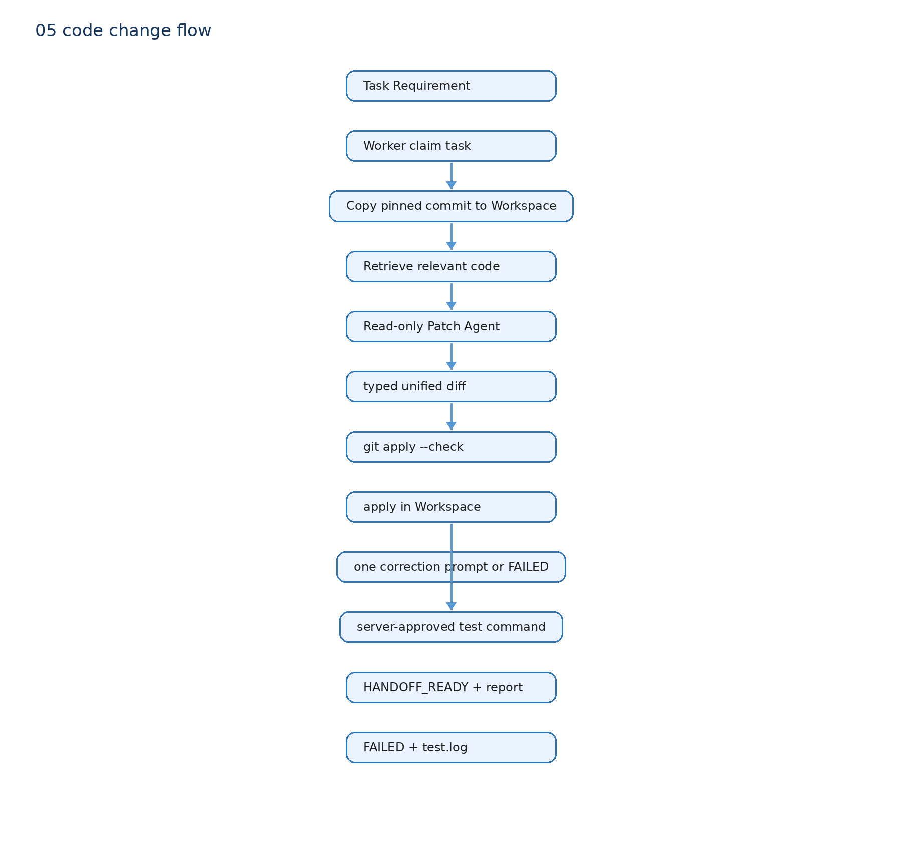

# 06 Workspace、Sandbox 与真实代码修改

## 谁做什么

Agent：检索、读取、推理、提出 unified diff。它不能直接写文件或跑 shell。

Worker：`worker.py::execute_task()` 控制所有副作用。它调用 `workspace.py::prepare_workspace()` 从固定 source commit 复制 local-copy Workspace；`patcher.py::apply_patch_text()` 只在 Workspace 应用 diff；`test_runner.py::run_tests()` 执行服务端批准的测试 profile。

DeerFlow：提供 Agent Factory 和 SandboxProvider 抽象。当前 Code Change 实际使用 local-copy Workspace，不能说成容器级 Sandbox。

## 失败路径

diff 无法应用：`PATCH_APPLY_FAILED`，不运行测试。

测试失败：`TEST_FAILED`，保存 `test.log`，不进入 handoff。

模型没提交有效 Patch：`AGENT_GENERATION_FAILED`。

测试通过：生成报告、PR handoff 材料并停在 `HANDOFF_READY`；仍需人工 review，当前没有真实 GitHub PR。

测试结果当前不会再回送 Patch Agent 让它自动继续修改。也就是说，图里的 `Test Result → Agent` 是常见 Coding Agent 的演进方向，不是本项目已经实现的行为。当前失败后由 Task 记录错误，用户或受控 retry 决定下一步。

## 面试一句话

模型只生成候选 Patch，Workspace/Test 的副作用由 Worker 控制。这样源仓不会被直接改脏，失败可按检索、生成、应用或测试阶段定位。
