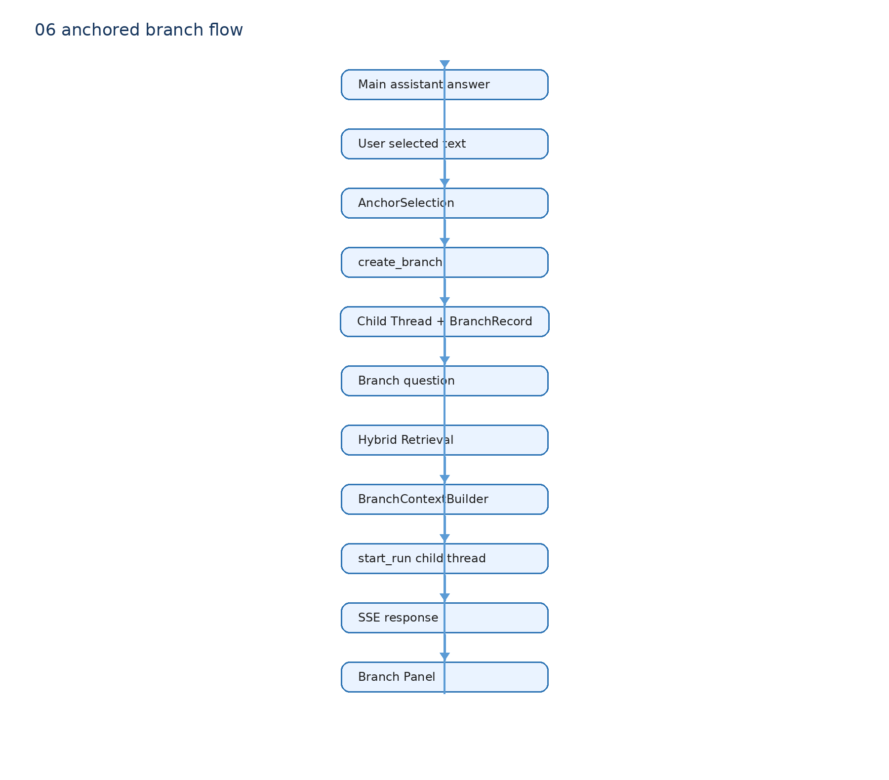

# 07 Anchored Branch：项目真正新增的上下文语义

线性主对话中，用户可能只想追问回答里的一个 JWT、缓存或代码片段。继续把所有追问写入 Main 会膨胀上下文；另开普通聊天又会丢失“我在问哪一句”。

## 真实调用链

`anchored-branch-panel.tsx` 捕获用户选区并调用 Branch API。

`routers/anchored_branch.py::_validated_anchor()` 校验 source assistant message、offset 与 Anchor 文本。

`create_branch()` 从 Main Checkpoint 截取 summary/relevant/main history，创建 DeerFlow Child Thread，并调用 `AnchoredBranchStore.create()` 保存 `BranchRecord`。

`stream_branch_run()` 读取 Child history；如 `code_change_project_id` 非空，调用同一个 `retrieve_context(project.repo_path, question)` 和 `build_retrieval_context()`。随后 `BranchContextBuilder.build()` 组合上下文，再用 `start_run(child_thread_id)` 启动 Branch 的 SSE Run。

## 隔离语义

Branch 消息、ToolMessage 和 Checkpoint 写到 Child Thread。关闭 Branch 只标记 BranchRecord/Child metadata，Main Thread 不变。一个 Main Answer 可建多个 Branch。

## 不存在的功能

当前没有 Decision、Decision Capsule、Accept/Edit/Reject、自动 Summary 回 Main、Apply/Merge 回 Main。文档中的任何“Branch Result 自动合并”都应改成“默认不合并”；这是项目刻意收敛的边界。

## 面试一句话

DeerFlow 提供 Child Thread、Run、Middleware 和 SSE；我新增 Anchor 的精确定位、Main/Child 关系、受预算的 Branch Context 和双栏交互，保证局部探索不污染主线。
