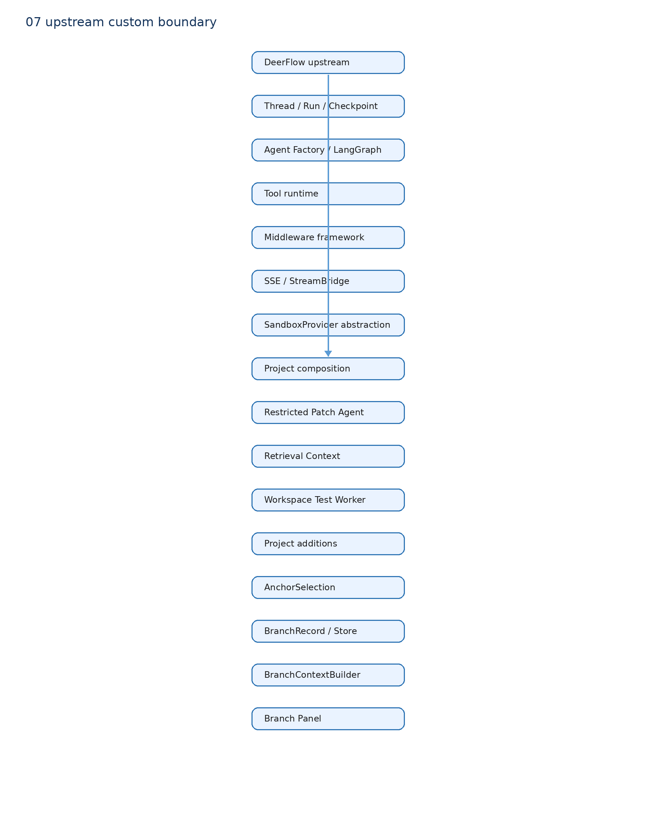

# 08 上游、组合与自研边界

| 模块 | DeerFlow 原生 | 项目组合/适配 | 项目自研 | 证据 |
| --- | :---: | :---: | :---: | --- |
| Agent Factory / LangGraph graph | ✓ |  |  | `deerflow/agents/factory.py` |
| Thread / Run / Checkpoint / SSE | ✓ |  |  | `runtime/`、`services.py::start_run` |
| Tool Runtime | ✓ |  |  | `create_deerflow_agent` / ToolNode |
| Coding Tool 集合 |  | ✓ |  | `code_change/agent_patch.py` |
| Workspace Patch/Test 流程 |  |  | ✓ | `code_change/worker.py` |
| Hybrid Code Retrieval |  |  | ✓ | `context_retriever.py` |
| AnchorSelection / BranchRecord |  |  | ✓ | `anchored_branch/models.py` |
| BranchContextBuilder / Store / API / UI |  |  | ✓ | `anchored_branch/`、Branch Panel |
| SandboxProvider 抽象 | ✓ |  |  | `deerflow/sandbox/` |

准确说法：我以 DeerFlow 作为基础设施层，限制和组合它的 Agent/Tool 能力完成 Coding Agent 工作流，并新增 Anchored Branch 上下文管理。不要说“我自研 DeerFlow”或“我从零实现 Agent Runtime”。
